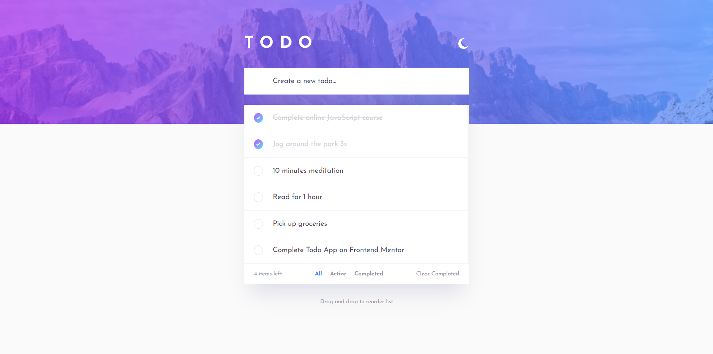
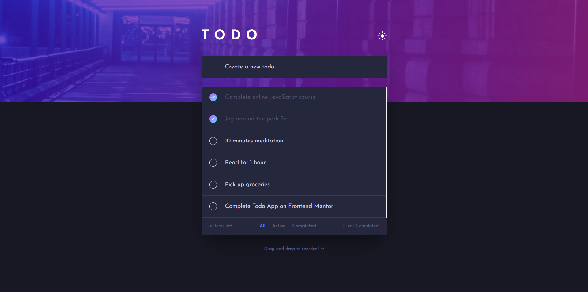

# Todo List Web App

## Live Demo

[Live Demo](https://todo-app-focuscode.vercel.app)

## Features

1. **Add, Check, and Delete Todos:**
   - Users can easily add new tasks to their todo list.
   - Mark todos as completed with a simple check.
   - Remove unwanted todos effortlessly.

2. **Filtering Options:**
   - Apply filters to view todos based on their status (All, Active, Completed).
   - Stay organized by focusing on specific types of tasks.

3. **Bulk Actions:**
   - Clear all completed todos with a single click, keeping your list clutter-free.

4. **Persistent Storage:**
   - Todos are securely stored in your browser's local storage.
   - Your todo list persists across page reloads, ensuring continuity.

5. **Drag-and-Drop Reordering:**
   - Easily rearrange your todos by dragging and dropping them into your preferred order.
   - Customizing your task sequence is both intuitive and efficient.

Whether you're a productivity enthusiast or just looking for a straightforward way to manage your daily tasks, this Todo List app is designed to make your life easier. Give it a try and stay organized effortlessly!
